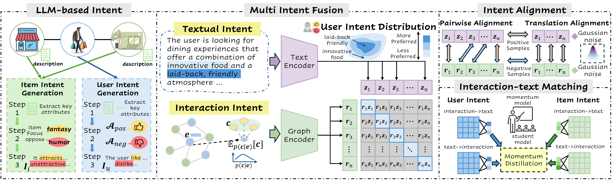

# [SIGIR 2025] IRLLRec: Intent Representation Learning with Large Language Model for Recommendation
Yu Wang, Lei Sang*, Yi Zhang and Yiwen Zhang. [[Paper link]](https://arxiv.org/abs/2502.03307)

## Model Architecture


You can download semantic embedding files in the following datasets:

**Amazon-book**/ **Yelp**/ **Amazon-movie** [[Google Drive]](https://drive.google.com/file/d/18gt8SNI2gpTJE5pshZ69Cy_EnqLrpY1X/view)

Each dataset consists of a training set, a validation set, and a test set. During the training process, we utilize the validation set to determine when to stop the training in order to prevent overfitting.

```plaintext
- book (yelp/movie)
|--- trn_mat.pkl # training set (sparse matrix)
|--- val_mat.pkl # validation set (sparse matrix)
|--- tst_mat.pkl # test set (sparse matrix)
|--- usr_emb_np.pkl # user text embeddings
|--- itm_emb_np.pkl # item text embeddings
|--- user_intent_emb_3.pkl # user intent embeddings
|--- item_intent_emb_3.pkl # item intent embeddings
```

# 🚀 Examples to run the codes

The command to evaluate the backbone models and RLMRec is as follows.

- **Backbone**
  ```bash
  python encoder/train_encoder.py --model {model_name} --dataset {dataset} --cuda 0

- **RLMRec**
  ```bash
  python encoder/train_encoder.py --model {model_name}_plus --dataset {dataset} --cuda 0
  ```
  ```bash
  python encoder/train_encoder.py --model {model_name}_gene --dataset {dataset} --cuda 0

- **IRLLRec**
  ```bash
  python encoder/train_encoder.py --model lightgcn_int --dataset movie --cuda 0

Hyperparameters:

The hyperparameters of each model are stored in encoder/config/modelconf (obtained by grid-search).

## 📝 Acknowledgement

To maintain fair comparisons and consistency, the model training framework, the user (item) profiles generated by LLM and their corresponding embedding representations are mainly adapted from the following repo:

> [https://github.com/HKUDS/RLMRec](https://github.com/HKUDS/RLMRec)

Many thanks to them for providing the training framework and for the active contribution to the open source community.


## Citation

If you find this useful for your research, please kindly cite the following paper:

```bibtex
@article{2025IRLLRec,
  title={Intent Representation Learning with Large Language Model for Recommendation},
  author={Wang, Yu and Sang, Lei and Zhang, Yi and Zhang, Yiwen},
  journal={arXiv preprint arXiv:2502.03307},
  year={2025}
}


